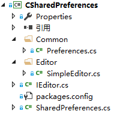

# 欢迎使用.Net平台上最简单的SharedPreferences封装类

[](https://travis-ci.org/taowenyin/CSharedPreferences) [](https://ci.appveyor.com/project/taowenyin/csharedpreferences)

## 1. 程序目录结构



> * Common：公共程序
> 1. Preferences.cs：SharedPreferences配置信息
> * Editor：各类数据编辑对象
> * IEditor.cs：SharedPreferences编辑对象接口
> * SharedPreferences.cs：SharedPreferences对象类

## 2. 引入的第三方库

| 库名称 | 库版本 | .Net版本 |
| :----: | :----: | :----: |
| Newtonsoft.Json | 9.0.1 | 2.0-4.5 |

## 3. 引入第三方库的方法

### 方法一：通过Vistual Studio自带的NuGet包管理工具引用第三方库

### 方法二：通过项目引用第三方DLL库

> 右键项目->添加->引用->浏览(B)...->选择需要的DLL->确定

## 4. 使用方法

#### Step1：通过单例模式获取SharedPreferences对象

```CSharp
using CSharedPreferences;

SharedPreferences preferences = SharedPreferences.GetInstance("preferences_name");
```

#### Step2：获取Editor编辑对象，并添加数据操作

1. 清空所有数据

```CSharp
/// <summary>
/// 清空所有Key值
/// </summary>
/// <returns>IEditor对象</returns>
IEditor Clear();
```

2. 把数据保存在本地

```CSharp
/// <summary>
/// 提交所有值
/// </summary>
/// <returns>IEditor对象</returns>
IEditor Commit();
```

3. 向数据添加Boolean类型

```CSharp
/// <summary>
/// 向SharesPreference添加Boolean类型的值
/// </summary>
/// <param name="key">Boolean类型的Key</param>
/// <param name="value">Boolean类型的值</param>
/// <returns>IEditor对象</returns>
IEditor PutBoolean(string key, bool value);
```

4. 向数据添加Float类型

```CSharp
/// <summary>
/// 向SharesPreference添加Float类型的值
/// </summary>
/// <param name="key">Float类型的Key</param>
/// <param name="value">Float类型的值</param>
/// <returns>IEditor对象</returns>
IEditor PutFloat(string key, float value);
```

5. 向数据添加Int类型

```CSharp
/// <summary>
/// 向SharesPreference添加Int类型的值
/// </summary>
/// <param name="key">Int类型的Key</param>
/// <param name="value">Int类型的值</param>
/// <returns>IEditor对象</returns>
IEditor PutInt(string key, int value);
```

6. 向数据添加Long类型

```CSharp
/// <summary>
/// 向SharesPreference添加Long类型的值
/// </summary>
/// <param name="key">Long类型的Key</param>
/// <param name="value">Long类型的值</param>
/// <returns>IEditor对象</returns>
IEditor PutLong(string key, long value);
```

7. 向数据添加String类型

```CSharp
/// <summary>
/// 向SharesPreference添加String类型的值
/// </summary>
/// <param name="key">String类型的Key</param>
/// <param name="value">String类型的值</param>
/// <returns>IEditor对象</returns>
IEditor PutString(string key, string value);
```

8. 向数据添加Double类型

```CSharp
/// <summary>
/// 向SharesPreference添加Double类型的值
/// </summary>
/// <param name="key">Double类型的Key</param>
/// <param name="value">Double类型的值</param>
/// <returns>IEditor对象</returns>
IEditor PutDouble(string key, double value);
```

9. 移除指定Key的值

```CSharp
/// <summary>
/// 移除对应Key的值
/// </summary>
/// <param name="key">要移除的Key</param>
/// <returns>IEditor对象</returns>
IEditor Remove(string key);
```

#### Step3：执行Commit()把数据库保存在本地

```CSharp
using CSharedPreferences;

editor.Commit();
```

#### Step4：获取SharedPreferences数据操作

1. 获取SharedPreferences文件名称

```CSharp
/// <summary>
/// 获取SharedPreferences文件名
/// </summary>
/// <returns>SharedPreferences文件名</returns>
public string getSharedPrefName();
```

2. 获取SharedPreferences单例对象

```CSharp
/// <summary>
/// 获取SharedPreferences单例
/// </summary>
/// <param name="name">SharedPreferences文件名</param>
/// <returns>SharedPreferences单例对象</returns>
public static SharedPreferences GetInstance(string name);
```

3. 判断Key值是否存在

```CSharp
/// <summary>
/// 判断Key值是否存在
/// </summary>
/// <param name="key">要判断的Key值</param>
/// <returns>Ture：表示Key存在，False：表示Key不存在</returns>
public bool Contains(string key);
```

4. 获取Editor对象

```CSharp
/// <summary>
/// 获取Editor对象
/// </summary>
/// <returns>Editor对象</returns>
public IEditor GetEditor();
```

5. 获取Boolean类型的值

```CSharp
/// <summary>
/// 获取Boolean类型的Key值
/// </summary>
/// <param name="key">检索的Key值</param>
/// <param name="defValue">如果Key不存在，则使用的默认值</param>
/// <returns>Key对应的值</returns>
public bool GetBoolean(string key, bool defValue);
```

6. 获取Float类型的值

```CSharp
/// <summary>
/// 获取Float类型的Key值
/// </summary>
/// <param name="key">检索的Key值</param>
/// <param name="defValue">如果Key不存在，则使用的默认值</param>
/// <returns>Key对应的值</returns>
public float GetFloat(string key, float defValue);
```

7. 获取Int类型的值

```CSharp
/// <summary>
/// 获取Int类型的Key值
/// </summary>
/// <param name="key">检索的Key值</param>
/// <param name="defValue">如果Key不存在，则使用的默认值</param>
/// <returns>Key对应的值</returns>
public int GetInt(string key, int defValue);
```

8. 获取Long类型的值

```CSharp
/// <summary>
/// 获取Long类型的Key值
/// </summary>
/// <param name="key">检索的Key值</param>
/// <param name="defValue">如果Key不存在，则使用的默认值</param>
/// <returns>Key对应的值</returns>
public long GetLong(string key, long defValue);
```

9. 获取Double类型的值

```CSharp
/// <summary>
/// 获取Double类型的Key值
/// </summary>
/// <param name="key">检索的Key值</param>
/// <param name="defValue">如果Key不存在，则使用的默认值</param>
/// <returns>Key对应的值</returns>
public double GetDouble(string key, double defValue);
```

10. 获取String类型的值

```CSharp
/// <summary>
/// 获取String类型的Key值
/// </summary>
/// <param name="key">检索的Key值</param>
/// <param name="defValue">如果Key不存在，则使用的默认值</param>
/// <returns>Key对应的值</returns>
public string GetString(string key, string defValue)
```